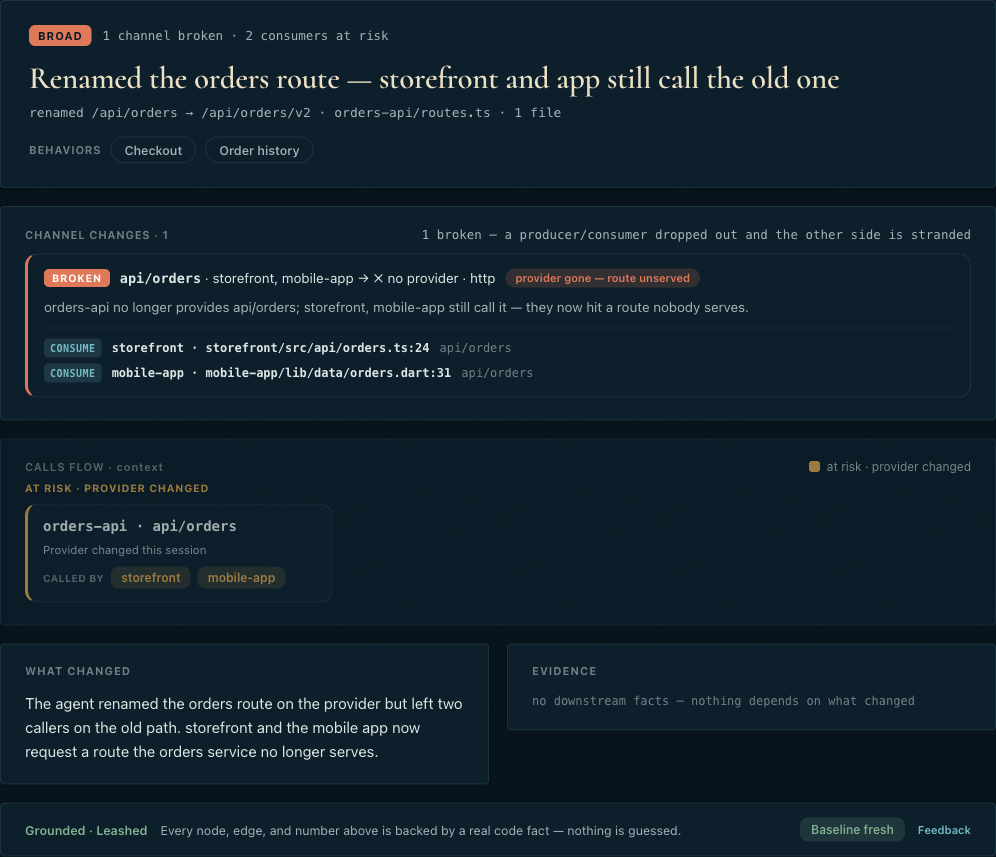

<div align="center">


# Visual mental models for AI-generated code changes

Before you accept an agent's diff, see what changed in **behavior, flow, contracts, and architecture** — with every claim grounded in real code.

[](https://github.com/mappamind/mappamind/actions/workflows/ci.yml)
[](https://www.npmjs.com/package/mappamind-cli)
[](LICENSE)
[](#requirements)

[See it fast](#see-it-fast) · [What the card shows](#what-the-card-shows) · [Quickstart](#quickstart) · [Commands](#common-commands) · [Agent setup](#agent-setup) · [Coverage](#what-it-covers) · [Discussions](https://github.com/mappamind/mappamind/discussions)

</div>

---

<div align="center">


<p><b><a href="https://mappamind.github.io/mappamind/">▶ See live examples →</a></b> · static cards from a fictional storefront, exactly what Mappamind renders for your repo</p>
</div>

## Why this exists

AI agents can write a lot of code in one session. A 40-file diff is normal now — and you didn't author it.

When you didn't write the change, **you lose the mental model.** A line diff shows you the text that moved, but not what it *did*: which behaviors changed, which service calls now break, which consumers are stranded, what shifted in your architecture.

Mappamind draws that picture. At the accept moment — in-session, while the change is still in your hands — it renders an evidence-grounded **before/after** of your system so you can decide **Accept / Reject / Correct** on the impact, not just the text.

Every claim on the card cites a real code fact or it is dropped. The model cannot invent an endpoint or a dependency; both ends of every edge come from facts in your code. When the evidence isn't there, Mappamind stays quiet rather than inventing architecture.

## See it fast

Two ways to get the idea before installing anything:

1. **Open the live gallery** → **[mappamind.github.io/mappamind](https://mappamind.github.io/mappamind/)** — real example cards (a broken channel, multiple breaks, a calm session, the Studio), exactly what Mappamind renders for a repo.
2. **Point it at any local repo, read-only, no model calls:**

   ```sh
   npx -p mappamind-cli mappamind status <path-to-repo>
   ```

   This discovers repos, reports baseline freshness, and prints the Studio URL — without building anything or shelling out to a model.

To render a real before/after card for **your** repo, run the three-step [Quickstart](#quickstart) below. (That step needs a model CLI on your `PATH` and makes real model calls, so it isn't instant — but it's a few seconds on a small-to-medium repo.)

## What the card shows

A shift card is a single self-contained HTML page. In plain language, it tells you:

- **Changed behavior** — a grounded narration of what the session actually did, not a restatement of the diff.
- **Impacted channels and contracts** — cross-service calls that were **added**, **changed**, or **broken** (a route a caller still hits but nothing serves).
- **Callers / consumers at risk** — every stranded caller or downstream consumer, named so you know who breaks.
- **Evidence** — each claim is anchored to a real `file:line` in your code; you can click through and check it.
- **Grounded fallback** — when there isn't enough evidence, or no model host is available, the card falls back to deterministic narration instead of guessing. Cosmetic or leaf-only changes are folded when detected, so the card stays quiet rather than ringing for a no-op.

## Install

```sh
npm i -g mappamind-cli
```

This installs the `mappamind` command. (The package is published as `mappamind-cli`; the command you run is `mappamind`.)

**Prerequisite:** a model CLI on your `PATH` — [Claude Code](https://claude.com/claude-code) (`claude`) or [Codex](https://developers.openai.com/codex) (`codex`). Mappamind shells out to the host you choose for grounded baseline synthesis and shift narration; no API key required.

> Trying it without installing? `npx -p mappamind-cli mappamind status <repo>` works for a quick look, but the lifecycle hooks invoke the bare `mappamind` binary, so hooks need the global install above.

## Quickstart

Five minutes from install to your first card.

```sh
# 1. Point Mappamind at a repo (or a parent folder of repos)
mappamind status .

# 2. Build the grounded baseline — the "before" picture
mappamind setup . --host claude --yes   # or: --host codex

# 3. Wire lifecycle hooks into supported agents
mappamind hooks --install

# 4. Run a normal agent session. When it ends, the Stop hook renders
#    the before/after card to .mappamind/shift/latest.html and opens it —
#    so you can decide whether to accept the change in your agent.
```

`mappamind setup` makes real model calls to synthesize grounded capabilities and adjudicate candidate channels, so it requires an explicit model host. If the selected host fails, setup stops without writing a baseline. On a small-to-medium repo that is usually seconds; larger repos cost more on first run. The CLI prints a progress estimate up front.

To refresh an existing baseline after structural changes, run:

```sh
mappamind setup . --host claude --force --yes
```

Use `--host claude` or `--host codex` every time you run setup. Agent skills should pass the host they are running under.

### What you get on disk

Mappamind writes one Studio file during setup, then adds shift cards when agent sessions change code:

```text
.mappamind/
├── index.html                 # Studio: mesh, shifts, capabilities, contracts
└── shift/
    ├── latest.html            # latest non-cosmetic shift card
    └── <timestamp>.html       # archived cards linked from the Studio
```

The durable baseline and channel cache live beside these files under `.mappamind/state/`. See [Storage and privacy](#storage-and-privacy).

## Agent Setup

Mappamind is host-neutral at the CLI layer. Agents are just lifecycle triggers: `SessionStart` records the before snapshot, and `Stop` renders the shift card.

**Claude Code**

Install from the Claude marketplace:

```sh
/plugin marketplace add mappamind/mappamind
/plugin install mappamind@mappamind-plugins
```

The marketplace plugin includes the `mappamind` skill and lifecycle hooks.

**Codex**

Codex does not offer self-serve plugin publishing yet, so wire project hooks directly:

```sh
mappamind hooks --install --agent codex
```

This installs `SessionStart` and `Stop` hooks into the repo's `.codex/`. Review and trust them with `/hooks`. Remove them with:

```sh
mappamind hooks --remove --agent codex
```

Do not run both a plugin-bundled hook and a project hook for the same host; that would snapshot and shift twice.

### Plugin Skill

The plugin ships one skill:

| Skill | What it does |
|---|---|
| `mappamind` | Checks status, guides first baseline setup, snapshots before code edits, runs the shift card after meaningful changes, and tells the agent to include local Studio/card URLs in its final response. |

That is enough for the current product. Add more skills only when there is a distinct user workflow, such as benchmark evaluation, release packaging, or a future query/serve mode. Extra skills should not duplicate the lifecycle hook behavior.

## Common Commands

| Command | Use |
|---|---|
| `mappamind status <root>` | Discover repos, show baseline freshness, Studio URL, and hook warnings. |
| `mappamind setup <root> --host claude --yes` | Build the first grounded baseline and Studio with Claude Code. |
| `mappamind setup <root> --host codex --yes` | Build the first grounded baseline and Studio with Codex. |
| `mappamind setup <root> --host claude --force --yes` | Rebuild and replace an existing baseline, even if it is current. |
| `mappamind hooks <root> --install --agent all` | Install Claude Code and Codex project hooks. |
| `mappamind hooks <root> --remove --agent codex` | Remove only Codex project hooks. |
| `mappamind snapshot <root>` | Manually record the before snapshot for a session. |
| `mappamind shift <root>` | Manually render the current before/after card. |
| `mappamind shift <root> --no-model` | Render with deterministic fallback narration only. |
| `mappamind watch <root> --interval 30` | Polling mode for non-agent/manual editing sessions. |

`<root>` can be a git repo or a parent workspace containing multiple git repos. Multi-repo workspaces qualify paths as `repo/path`.

## Storage and Privacy

Mappamind stores two different classes of output:

| Output | Location | Commit it? |
|---|---|---|
| Studio and shift cards | `<root>/.mappamind/` | No. It is generated local output. |
| Durable baseline, channel cache, before snapshot, and shift history | `<root>/.mappamind/state/workspaces/<id>/` | No. It is generated local memory for that workspace. |

Set `MAPPAMIND_STATE_DIR=/path/to/state` to move the durable store, for example in tests or CI.

Baselines are local to the repo/workspace path, not to each git branch. Checking out another branch can make the stored baseline stale; `mappamind status` warns when the current structural facts no longer match it. Shift cards still work because they compare the session-start snapshot to the session-end tree. Run `mappamind setup . --host claude --force --yes` only when you want the current branch/worktree to become the standing Studio baseline.

The repository `.gitignore` should include:

```gitignore
.mappamind/
.claude/
.codex/
```

Mappamind reads source locally with tree-sitter and shells out to a model CLI already on your machine (`claude` or `codex`) for grounded synthesis and narration. It does not require API keys, and rendered HTML is self-contained: no network, no external assets, no scripts. Disable browser opening with:

```sh
MAPPAMIND_OPEN=0 mappamind shift .
```

See [PRIVACY.md](PRIVACY.md) for the full statement: no telemetry, local-only storage, and exactly what is sent to the model CLI you choose.

## What it covers

Tree-sitter facts across **17 languages** out of the box (TypeScript, JavaScript, Go, Python, Java, C#, C, C++, PHP, Ruby, Rust, Kotlin, Swift, Scala, Dart, shell, and more). New language or framework coverage is a prompt and a schema, not new parsing code.

### Good for

- **Frontend + backend repos** — a web app talking to its API.
- **Service architectures** — microservices that call each other across a boundary.
- **Multi-repo workspaces** — a suite of repos analyzed together, with cross-repo channels.
- **Agent-generated changes that touch behavior, flows, contracts, or APIs** — exactly where a line diff hides the impact.

### Not ideal for yet

- **Purely cosmetic changes** — formatting, comments, and leaf-only edits fold by design, so the card stays quiet.
- **Single-file scripts** — there's little cross-boundary structure to draw.
- **Repos with no meaningful cross-boundary flow** — on a single in-process codebase or a monorepo of independent tools, Mappamind tells you there's no mesh to draw instead of fabricating one. That's the design; the picture there is naturally sparse.

See **[Coverage & support](docs/COVERAGE.md)** for the full language list, the repo and workspace shapes it handles, and the size limits.

## How it works

Four layers, from raw code facts to the picture you see:

| Layer | What |
|---|---|
| 4 · Conveyance | the **before/after picture**, in-session at the accept moment |
| 3 · Trigger | the **agent-session boundary** (Claude Code / Codex lifecycle hooks) |
| 2 · Leash | **grounded** comprehension — cite a real fact or drop the claim |
| 1 · Code graph | blast-radius traversal over tree-sitter facts (imports → calls → contracts) |

Two design rules keep the product honest and off the per-language treadmill:

- **The leash:** every intelligent output cites a real code fact or it is dropped. Unsupported claims never reach the card.
- **The anti-treadmill rule:** new language or medium coverage is always a prompt + a schema, never a new framework catcher.

Two moments:

```
BASELINE (the "before")               SHIFT (the accept moment)
repo ─▶ capture ─▶ extractors ─▶      agent session ENDS ─▶ [Stop hook]
   facts ─▶ leash (ground) ─▶            capture diff ─▶ blast radius
   the Studio: mesh, capabilities,        ├─ cosmetic? ─▶ fold, no alarm
   contracts, history                     └─ real ─▶ narrate (leashed) ─▶
                                              before/after card
```

The Studio is one page with four tabs — **Studio** (the service mesh), **Shifts** (session history), **Capabilities**, **Contracts** — switched with CSS-only tabs. Workspace cards qualify paths as `repo/path`, so a microservice suite or a web-app-plus-backend renders without name collisions.

### Cost and latency

The first baseline is the expensive step because Mappamind reads the workspace and asks the model to synthesize grounded capabilities. Per-session shift cards are smaller: they diff against the before snapshot, traverse only the affected graph slice, fold cosmetic changes, and avoid model calls when nothing downstream is hit.

Today Mappamind re-reads the tree each session. For large repositories, `status`, `setup`, and `shift` print a large-repo advisory instead of hiding the cost. A token-usage chart belongs in benchmarks once the eval data is stable; until then, this README avoids implying a precise cost curve.

For the deeper design, read **[ARCHITECTURE.md](docs/ARCHITECTURE.md)**.

## Requirements

- **Node 20 or newer.**
- A model CLI on `PATH`: `claude` or `codex`.
- **macOS and Linux** are supported. Windows is untested — the hooks use POSIX shell, so use WSL.
- Grammars are WebAssembly (no native compile on install).

## Troubleshooting

**`mappamind: command not found` inside hooks**

Install globally with `npm i -g mappamind-cli`, then reinstall hooks so they capture a stable binary path:

```sh
mappamind hooks --install
```

**Codex hooks do not run**

Run `/hooks` in Codex and trust the project hooks. If you also installed a Codex plugin later, remove project hooks:

```sh
mappamind hooks --remove --agent codex
```

**Baseline is stale**

That means the current structural facts no longer match the stored baseline. It can happen after structural edits or after checking out another branch. Shift cards still compare session start to session end; refresh intentionally when this branch/worktree should become the standing baseline:

```sh
mappamind setup . --host claude --force --yes
```

**No card appears**

Cosmetic shifts fold by design. Run `mappamind shift .` manually to see the fold reason, or set `MAPPAMIND_OPEN=0` in headless environments and use the printed `card: file://...` URL.

## Develop

```sh
npm install
npm run build
npm link -w @mappamind_/pipeline
mappamind status "$(pwd)"
npm test
```

Repo layout:

```
packages/
  capture/      fs watcher + git
  extractors/   tree-sitter facts, 17 languages
  baseline/     THE LEASH — propose → ground → keep
  seam/         cross-boundary contracts + the service mesh
  impact/       the blast radius (computeBlastRadius, diffServiceGraphs)
  synthesis/    grounded capability synthesis via a model CLI
  store/        structured JSON/JSONL persistence
  scoring/      precision/recall/citation harness
  pipeline/     composition root + the Studio render + the mappamind CLI
  ledger/       append-only evidence/shift history
  core/         shared primitives
  mappamind/    thin wrapper — the published `mappamind` bin
docs/
  ARCHITECTURE.md  how the system works (read first)
```

## Contributing & feedback

This is open source, and the goal is for Mappamind to be the obvious answer to "what did my agent just do?" Issues, ideas, and pull requests are welcome — see **[CONTRIBUTING.md](CONTRIBUTING.md)** to get started.

Tell us what landed and what didn't in [**Discussions**](https://github.com/mappamind/mappamind/discussions) — especially: did a card make a real change's impact obvious at the accept moment? Found a confusing card or a claim that wasn't grounded? Open a [false-positive report](https://github.com/mappamind/mappamind/issues/new/choose).

The **[Roadmap](docs/ROADMAP.md)** lays out what's next and the rules to build it by; **[ARCHITECTURE.md](docs/ARCHITECTURE.md)** explains how the system works (read it first).

### Contributors

<a href="https://github.com/mappamind/mappamind/graphs/contributors">
  
</a>

## License

[MIT](LICENSE) © Mappamind contributors
